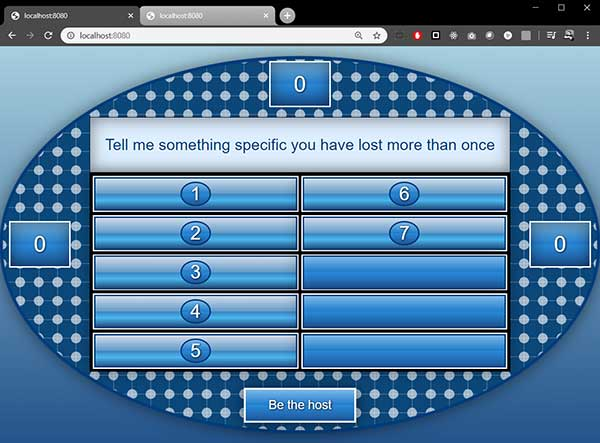
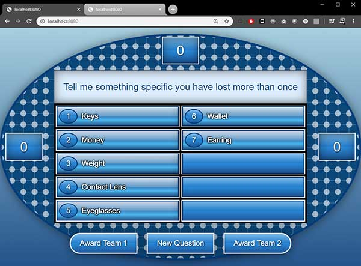
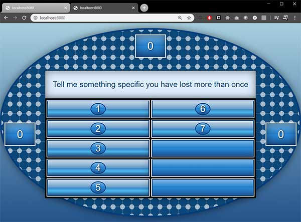

# Family Feud using Node.js Express & Socket.io

This is an experiment to create a server with a live socket in order to set up a **game host instance** and an **audiance display instance** for a web app.  Once the host is selected, they will have control over the audiance board and points.  

## Install and start

```bash
git clone https://github.com/MacEvelly/Family-Feud.git
cd Family-Feud
npm install
npm start
```

Terminal should respond with:

```bash
Listening on 8080
```

## Play Family Feud

* Open two browser windows at http://localhost:8080/
* Click **Be the host** to assign that window to become the game **host controller**. All other open instances will become the **audiance window** window. 
* As the **host** you can:
   * click to reveal answers
   * assign points
   * go to new questions

### Default instance:


### Host instance:


### Audience instance:


